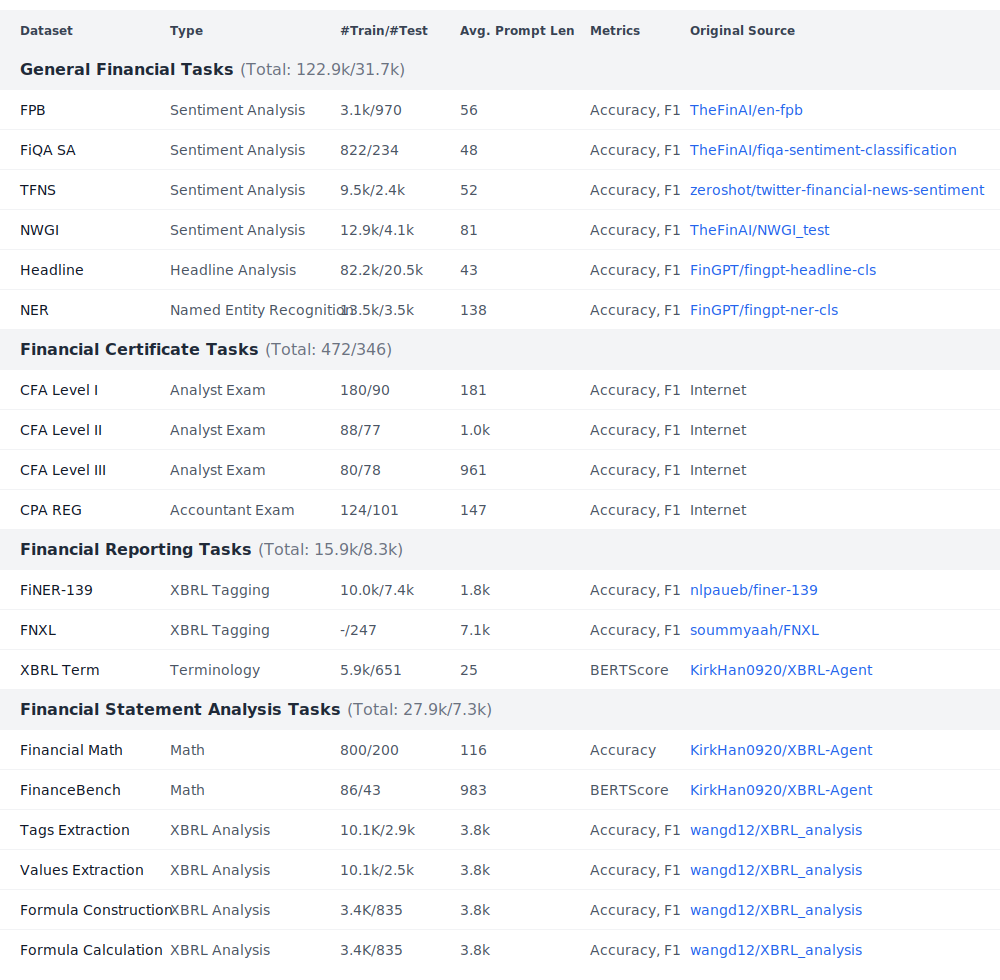

# FinLoRA: Benchmarking LoRA Methods for Fine-Tuning LLMs on Financial Datasets

<p>
  <a href="https://huggingface.co/datasets/wangd12/XBRL_analysis"></a>
  <a href="https://huggingface.co/spaces/wangd12/xbrl_llm_demo"></a>
  <a href="https://huggingface.co/wangd12/"></a>
  <a href="https://arxiv.org/abs/2505.19819"></a>
  <a href="https://finlora-docs.readthedocs.io/en/latest/"></a>

</p>

## Abstract

Low-rank adaptation (LoRA) methods show great potential for scaling pre-trained general-purpose Large Language Models (
LLMs) to hundreds or thousands of use scenarios. However, their efficacy in high-stakes domains like finance is rarely
explored, e.g., passing CFA exams and analyzing SEC filings. In this paper, we present the open-source FinLoRA project
that benchmarks LoRA methods on both general and highly professional financial tasks. First, we curated 19 datasets
covering diverse financial applications; in particular, we created four novel XBRL analysis datasets based on 150 SEC
filings. Second, we evaluated five LoRA methods and five base LLMs. Finally, we provide extensive experimental results
in terms of accuracy, F1, and BERTScore and report computational cost in terms of time and GPU memory during fine-tuning
and inference stages. We find that LoRA methods achieved substantial performance gains of 36% on average over base
models. Our FinLoRA project provides an affordable and scalable approach to democratize financial intelligence to the
general public.

## Motivation

The announcement of the proprietary BloombergGPT model in April 2023 highlighted the significant potential of Large
Language Models tailored for finance (FinLLMs). However, BloombergGPT's "train-from-scratch" approach was
resource-intensive, reportedly requiring one million GPU hours at an estimated cost of $3 million (based on $3 per GPU
hour in 2023). This substantial investment underscores the need for more cost-effective solutions.

To address this, we leverage open-source models, such as Llama 3.1, and employ the LoRA (Low-Rank Adaptation)
fine-tuning method. This approach dramatically reduces the number of trainable parameters to as little as 0.01% of the
full model, bringing the computational cost down to less than $100, making advanced FinLLM capabilities more accessible.

## Financial Tasks

Our goal is to develop models capable of performing a range of financial tasks, from general applications to
professional-level functions. A critical area within professional finance is the eXtensible Business Reporting
Language (XBRL), the global standard for digital business reporting. XBRL, being XML-based, is inherently complex,
making it challenging for humans to generate and interpret directly.

We are particularly interested in two key XBRL applications:

**1. Financial Reporting:** Assisting small and medium-sized businesses (SMBs) in generating compliant financial reports
in the XBRL format.

**2. Financial Statement Analysis:** Facilitating the extraction of data from XBRL financial reports and enabling
insightful analysis.

## Datasets


[//]: # ()
[//]: # (| **Datasets**                                               | **Types**                | **#Train/#Test** | **Average Prompt Length** | **Metrics**  | **Original Source & License**                                                                                                                      |)

[//]: # (|------------------------------------------------------------|--------------------------|------------------|---------------------------|--------------|----------------------------------------------------------------------------------------------------------------------------------------------------|)

[//]: # (| **General Financial Tasks** &#40;Total: 122.9k/31.7k&#41;          |                          |                  |                           |              |                                                                                                                                                    |)

[//]: # (| FPB                                                        | Sentiment Analysis       | 3.1k/970         | 56                        | Accuracy, F1 | [TheFinAI/en-fpb]&#40;https://huggingface.co/datasets/TheFinAI/en-fpb&#41;, CC BY-SA 3.0                                                                   |)

[//]: # (| FiQA SA                                                    | Sentiment Analysis       | 822/234          | 48                        | Accuracy, F1 | [TheFinAI/fiqa-sentiment-classification]&#40;https://huggingface.co/datasets/TheFinAI/fiqa-sentiment-classification&#41;, MIT                              |)

[//]: # (| TFNS                                                       | Sentiment Analysis       | 9.5k/2.4k        | 52                        | Accuracy, F1 | [zeroshot/twitter-financial-news-sentiment]&#40;https://huggingface.co/datasets/zeroshot/twitter-financial-news-sentiment&#41;, MIT                        |)

[//]: # (| NWGI                                                       | Sentiment Analysis       | 12.9k/4.1k       | 81                        | Accuracy, F1 | [TheFinAI/NWGI_test]&#40;https://huggingface.co/datasets/TheFinAI/NWGI_test&#41;, MIT                                                                      |)

[//]: # (| Headline                                                   | Headline Analysis        | 82.2k/20.5k      | 43                        | Accuracy, F1 | [FinGPT/fingpt-headline-cls]&#40;https://huggingface.co/datasets/FinGPT/fingpt-headline-cls&#41;, CC BY-SA 3.0                                             |)

[//]: # (| NER                                                        | Named Entity Recognition | 13.5k/3.5k       | 138                       | Accuracy, F1 | [FinGPT/fingpt-ner-cls]&#40;https://huggingface.co/datasets/FinGPT/fingpt-ner-cls&#41;, CC BY-SA 3.0                                                       |)

[//]: # (| **Financial Certificate Tasks** &#40;Total: 472/346&#41;           |                          |                  |                           |              |                                                                                                                                                    |)

[//]: # (| CFA Level I                                                | Analyst Exam             | 180/90           | 181                       | Accuracy, F1 | Internet &#40;Public; Not Released Due to Copyright&#41;                                                                                                   |)

[//]: # (| CFA Level II                                               | Analyst Exam             | 88/77            | 1.0k                      | Accuracy, F1 | Internet &#40;Public; Not Released Due to Copyright&#41;                                                                                                   |)

[//]: # (| CFA Level III                                              | Analyst Exam             | 80/78            | 961                       | Accuracy, F1 | Internet &#40;Public; Not Released Due to Copyright&#41;                                                                                                   |)

[//]: # (| CPA REG                                                    | Accountant Exam          | 124/101          | 147                       | Accuracy, F1 | Internet &#40;Public; Not Released Due to Copyright&#41;                                                                                                   |)

[//]: # (| **Financial Reporting Tasks** &#40;Total: 15.9k/8.3k&#41;          |                          |                  |                           |              |                                                                                                                                                    |)

[//]: # (| FiNER-139                                                  | XBRL Tagging             | 10.0k/7.4k       | 1.8k                      | Accuracy, F1 | [nlpaueb/finer-139]&#40;https://huggingface.co/datasets/nlpaueb/finer-139&#41;, CC BY-SA 4.0                                                               |)

[//]: # (| FNXL                                                       | XBRL Tagging             | -/247            | 7.1k                      | Accuracy, F1 | [soummyaah/FNXL]&#40;https://github.com/soummyaah/FNXL&#41;, Public                                                                                        |)

[//]: # (| XBRL Term                                                  | Terminology              | 5.9k/651         | 25                        | BERTScore    | [KirkHan0920/XBRL-Agent]&#40;https://github.com/KirkHan0920/XBRL-Agent/blob/main/Datasets/XBRL%20Terminology.xlsx&#41;, MIT                                |)

[//]: # (| **Financial Statement Analysis Tasks** &#40;Total: 27.9k/7.3k&#41; |                          |                  |                           |              |                                                                                                                                                    |)

[//]: # (| Financial Math                                             | Math                     | 800/200          | 116                       | Accuracy     | [KirkHan0920/XBRL-Agent]&#40;https://github.com/KirkHan0920/XBRL-Agent/blob/main/Datasets/formulas_with_explanations_with_questions_with_gt.xlsx&#41;, MIT |)

[//]: # (| FinanceBench                                               | Math                     | 86/43            | 983                       | BERTScore    | [KirkHan0920/XBRL-Agent]&#40;https://github.com/KirkHan0920/XBRL-Agent/blob/main/Datasets/financebench.xlsx&#41;, CC BY-NC 4.0                             |)

[//]: # (| Tags Extraction                                            | XBRL Analysis            | 10.1K/2.9k       | 3.8k                      | Accuracy, F1 | [wangd12/XBRL_analysis]&#40;https://huggingface.co/datasets/wangd12/XBRL_analysis&#41;, MIT                                                                |)

[//]: # (| Values Extraction                                          | XBRL Analysis            | 10.1k/2.5k       | 3.8k                      | Accuracy, F1 | [wangd12/XBRL_analysis]&#40;https://huggingface.co/datasets/wangd12/XBRL_analysis&#41;, MIT                                                                |)

[//]: # (| Formula Construction                                       | XBRL Analysis            | 3.4K/835         | 3.8k                      | Accuracy, F1 | [wangd12/XBRL_analysis]&#40;https://huggingface.co/datasets/wangd12/XBRL_analysis&#41;, MIT                                                                |)

[//]: # (| Formula Calculation                                        | XBRL Analysis            | 3.4K/835         | 3.8k                      | Accuracy, F1 | [wangd12/XBRL_analysis]&#40;https://huggingface.co/datasets/wangd12/XBRL_analysis&#41;, MIT                                                                |)


<style>
.figure {
    border-radius: 12px;
    border: 1px solid rgba(0, 0, 0, .1);
    padding: 10px 25px;
    background-color: #fff;
}
</style>

## Benchmark Results


Llama models are their Instruct versions.

Our models achieve the following performance on financial tasks. The table below shows accuracy/F1 scores. -/value represents
BERTScore F1.

<details><summary>Full Results</summary>


| **Datasets**                           | **Base Models** |               |             |             |               | **Fine-tuned Models** |                     |                     |                     |                     |
|----------------------------------------|-----------------|---------------|-------------|-------------|---------------|-----------------------|---------------------|---------------------|---------------------|---------------------|
|                                        | Llama 3.1 8B Instruct    | Llama 3.1 70B Instruct | DeepSeek V3 | GPT-4o      | Gemini 2.0 FL | Llama 3.1 8B Instruct LoRA     | Llama 3.1 8B Instruct QLoRA  | Llama 3.1 8B Instruct DoRA   | Llama 3.1 8B Instruct rsLoRA | Gemini 2.0 FL       |
| **General Financial Tasks**            |                 |               |             |             |               |                       |                     |                     |                     |                     |
| FPB                                    | 68.73/0.677     | 74.50/0.736   | 78.76/0.764 | 81.13/0.818 | 81.02/0.894   | 85.64/0.922           | 84.16/0.909         | 81.93/0.901         | 82.84/0.853         | **87.62**/0.878     |
| FiQA SA                                | 46.55/0.557     | 47.27/0.565   | 60.43/0.686 | 72.34/0.773 | 68.09/0.810   | 81.28/**0.884**       | 78.30/0.874         | 78.72/0.874         | 73.19/0.806         | **88.09**/0.879     |
| TFNS                                   | 69.97/0.683     | 68.42/0.686   | 84.38/0.846 | 73.32/0.740 | 26.38/0.385   | 88.02/**0.932**       | 83.84/0.910         | 59.09/0.702         | 59.51/0.655         | **89.49**/0.896     |
| NWGI                                   | 43.86/0.583     | 50.14/0.596   | 7.44/0.097  | 66.61/0.656 | 48.16/0.614   | 54.16/**0.690**       | 49.96/0.645         | 19.57/0.281         | 35.80/0.464         | **62.59**/0.581     |
| NER                                    | 48.89/0.569     | 46.28/0.454   | 40.82/0.360 | 52.11/0.523 | 65.13/0.769   | **98.05**/**0.981**   | 96.63/0.966         | 71.59/0.834         | 95.92/0.963         | 97.29/0.973         |
| Headline                               | 45.34/0.558     | 71.68/0.729   | 76.06/0.779 | 80.53/0.814 | 76.60/0.847   | 84.66/0.852           | 88.03/0.886         | 64.93/0.781         | 71.75/0.828         | **97.32**/**0.973** |
| **Financial Certificate Tasks**        |                 |               |             |             |               |                       |                     |                     |                     |                     |
| CFA Level 1                            | 13.33/0.133     | 42.22/0.418   | 54.44/0.556 | 63.33/0.631 | 55.56/0.556   | 86.67/0.867           | **87.78**/**0.878** | **87.78**/**0.878** | **87.78**/**0.878** | 52.22/0.530         |
| CFA Level 2                            | 19.48/0.199     | 29.87/0.303   | 46.75/0.485 | 55.84/0.563 | 56.67/0.567   | 88.31/0.883           | 83.12/0.835         | 90.91/0.909         | **92.21**/**0.922** | 51.11/0.519         |
| CFA Level 3                            | 16.67/0.179     | 24.36/0.271   | 47.44/0.496 | 51.28/0.517 | 52.56/0.538   | 70.51/0.705           | 66.67/0.675         | 69.23/0.697         | **79.49**/**0.795** | 51.28/0.557         |
| CPA REG                                | 31.68/0.317     | 41.58/0.426   | 65.35/0.654 | 67.33/0.667 | 63.37/0.638   | 80.20/0.802           | 88.12/0.885         | **90.10**/**0.901** | **90.10**/**0.901** | 51.28/0.557         |
| **Financial Reporting Tasks**          |                 |               |             |             |               |                       |                     |                     |                     |                     |
| FiNER                                  | 21.28/0.232     | 61.82/0.606   | 68.92/0.699 | 72.29/0.725 | 63.91/0.638   | 74.10/0.759           | 74.32/0.760         | 70.92/0.732         | 70.72/0.724         | **80.32**/**0.802** |
| FNXL                                   | 3.64/0.045      | 20.14/0.210   | 27.33/0.288 | 42.41/0.398 | 37.75/0.356   | 23.57/0.250           | 23.05/0.253         | 33.50/0.311         | 35.68/0.348         | **47.98**/**0.438** |
| XBRL Term                              | -/0.574         | -/0.587       | -/0.573     | -/0.584     | -/0.572       | -/0.599               | -/0.606             | -/0.606             | -/0.630             | -/**0.666**         |
| **Financial Statement Analysis Tasks** |                 |               |             |             |               |                       |                     |                     |                     |                     |
| Tag Extraction                         | 69.16/0.739     | 69.64/0.782   | 85.03/0.849 | 81.60/0.864 | 80.27/0.811   | **89.13**/0.886       | 86.89/0.872         | 80.44/0.896         | 85.26/0.879         | 85.03/**0.907**     |
| Value Extraction                       | 52.46/0.565     | 88.19/0.904   | 98.01/0.982 | 97.01/0.974 | 98.02/0.980   | 98.49/0.986           | 97.14/0.974         | 98.57/0.988         | 99.13/**0.992**     | **99.20**/**0.992** |
| Formula Construction                   | 12.92/0.201     | 59.28/0.665   | 22.75/0.315 | 79.76/0.820 | 61.90/0.644   | 77.61/0.876           | 89.34/**0.898**     | 88.02/0.882         | **89.46**/0.893     | 67.85/0.786         |
| Formula Calculation                    | 27.27/0.317     | 77.49/0.783   | 85.99/0.868 | 83.59/0.857 | 53.57/0.536   | 98.68/0.990           | 92.81/0.947         | **98.92**/**0.993** | 98.80/0.988         | 54.76/0.548         |
| FinanceBench                           | -/0.443         | -/0.528       | -/0.573     | -/0.564     | -/0.552       | -/0.511               | -/0.542             | -/0.477             | -/**0.575**         | -/0.544             |
| Financial Math                         | 11.00/0.136     | 10.50/0.134   | 21.50/0.255 | 27.00/0.296 | 19.00/0.204   | 30.00/0.332           | 26.50/0.307         | 28.50/0.317         | 34.50/0.370         | **66.00**/**0.785** |
| Overall Average                        | 37.05           | 52.36         | 57.16       | 63.39       | 58.97         | **74.74**             | 74.29               | 69.53               | 73.82               | 71.08               |

</details>


## LoRA Models
We use four LoRA methods: LoRA, QLoRA, DoRA, and rsLoRA. 
You can download LoRA adapators from the `lora_adaptors` directory or [Hugging Face](https://huggingface.co/wangd12). The adapters fine-tuned on financial datasets using various configurations (eg. 8-bit rank 8, 4-bit rank 4).

## File Structure

```
FinLoRA/
├── data/
│   ├── *.py  # Dataset processing code
│   ├── test/  # Test datasets
│   └── train/  # Training datasets
├── docs/  # Documentation 
├── lora/
│   ├── finetune.py  # Fine-tuning code using Axolotl
│   ├── flowertune-llm/  # Federated learning implementation
│   └── lora/  # Fine-tuning using HF PEFT
├── lora_adaptors/  
│   ├── 4bits_r4/
│   ├── 8bits_r8/
│   ├── 8bits_r8_dora/
│   ├── 8bits_r8_rslora/
│   ├── fp16_r8/
├── test/
│   ├── __init__.py
│   ├── fingpt_tests/
│   ├── inference.py
│   ├── README.md
│   ├── *.sh  # Test shell scripts
│   └── *.py
├── environment.yml  # Anaconda Enviornment
├── LICENSE
├── README.md
├── readthedocs.yml
├── requirements.txt
├── setup.sh
└── sphinx_requirements.txt
```

## Guide
### Setup

To install dependencies:

```bash
bash ./setup.sh
```

Login to HuggingFace:

```bash
huggingface-cli login
```

Enter your HuggingFace API token when prompted.

### Evaluation

To test adapters, navigate to the test directory:

```bash
cd test
bash run_all_adapters.sh
```

Define the adapters and tasks you want to run in the script, then execute:

```bash
bash run_all_adapters.sh
```

To run a base model (e.g., OpenAI):

```bash
bash run_openai.sh
```

Enter your API key in the file, set tasks to run, then execute:

```bash
bash run_openai.sh
```

### Fine-Tuning

To perform fine-tuning, navigate to the lora directory:

```bash
cd lora
axolotl fetch deepspeed+configs
```

Then run fine-tuning with a specific configuration:

```bash
python finetune.py formula_llama_3_1_8b_8bits_r8
```

If you don't have compute resources, you can rent 4 A5000s for cheap from [RunPod](https://www.runpod.io).

### Federated Learning

To run federated LoRA, navigate to the federated learning directory:

```bash
cd lora/flowertune-llm
```

Install dependencies:

```bash
pip install -e .
```

Run the federated learning simulation:

```bash
flwr run .
```

You can customize the configuration:

```bash
# Use OpenLLaMA-7B instead of 3B and 8-bits quantization
flwr run . --run-config "model.name='openlm-research/open_llama_7b_v2' model.quantization=8"

# Run for 50 rounds with 25% client participation
flwr run . --run-config "num-server-rounds=50 strategy.fraction-fit=0.25"
```

[//]: # ()
[//]: # (## Scenarios)

[//]: # ()
[//]: # (### Cross-task Generalization &#40;Mixture of LoRA Experts&#41;)

[//]: # ()
[//]: # (We started with single-task fine-tuning, i.e., fine-tune a LoRA adaptor for a task. We got good performance.)

[//]: # ()
[//]: # (Mixture of LoRA Experts &#40;LoRA-MoE&#41;: a LoRA module acts as an expert, a router network assigns weights, such as)

[//]: # (in [X-LoRA]&#40;https://arxiv.org/pdf/2402.07148&#41;. X-LoRA is built on top of HuggingFace PEFT.)

[//]: # ()
[//]: # (### Improving Performance and Scalability for Inference Stage)

[//]: # ()
[//]: # (SLoRA is designed for serving many LoRA adapters efficiently. It stores all adapters in the CPU memory and fetches the)

[//]: # (adapters needed to GPU memory. We will deploy it on a cloud server.)

[//]: # ()
[//]: # (Difficulty: Current SLoRA implementation does not work with HuggingFace, and does not support newer models like Llama 3.)

[//]: # ()
[//]: # (### Distributed Training with Enhanced Privacy)

[//]: # ()
[//]: # (Multiple institutions might want to collaborate to fine-tune a FinLLM using their private datasets. Using zero-Knowledge)

[//]: # (Proofs &#40;ZKPs&#41; in the fine-tuning stage allows enhanced data privacy.)

## Contributing

We welcome contributions to the FinLoRA project! Please feel free to submit issues, feature requests, and pull requests.

## License

This project is open source. Please check individual dataset licenses for specific usage terms.

## Citation

If you use this work, please cite:

```bibtex
@article{wang2025finlora,
  title={FinLoRA: Benchmarking LoRA Methods for Fine-Tuning LLMs on Financial Datasets},
  author={Wang, Dannong and Patel, Jaisal and Zha, Daochen and Yang, Steve Y and Liu, Xiao-Yang},
  journal={arXiv preprint arXiv:2505.19819},
  year={2025}
}
```

## References

[1] Xiao-Yang Liu, Jie Zhang, Guoxuan Wang, Weiqing Tong, Anwar Walid. FinGPT-HPC: Efficient Pretraining and Fine-Tuning
Large Language Models for Financial Applications with High-Performance Computing. IEEE ICDCS 2024.

[2] Mao, Y., Ge, Y., Fan, Y., Xu, W., Mi, Y., Hu, Z. and Gao, Y., 2024. A Survey on LoRA of Large Language Models. arXiv
preprint arXiv:2407.11046.

[3] Vlad Fomenko, Han Yu, Jongho Lee, Stanley Hsieh, Weizhu Chen. A Note on LoRA, 2024. https://arxiv.org/abs/2404.05086

[4] E.L. Buehler, M.J. Buehler. X-LoRA: Mixture of Low-Rank Adapter Experts, a Flexible Framework for Large Language
Models with Applications in Protein Mechanics and Design. https://arxiv.org/abs/2402.07148

[5] Sheng, Ying and Cao, Shiyi and Li. Dacheng and Hooper, et al. S-LoRA: Serving Thousands of Concurrent LoRA
Adapters. https://arxiv.org/pdf/2311.03285

[6] Xiao-Yang Liu, Rongyi Zhu, Daochen Zha, Jiechao Gao, Shan Zhong, Matt White, Meikang Qiu, Differentially Private
Low-Rank Adaptation of Large Language Model Using Federated Learning. https://arxiv.org/abs/2312.17493 ACM Transactions
on Management Information Systems, 2024.

[7] Loukas, L.; Fergadiotis, M.; Chalkidis, I.; Spyropoulou, E.; Malakasiotis, P.; Androutsopoulos, I.; and Paliouras,
G. 2022. FiNER: Financial Numeric Entity Recognition for XBRL Tagging.

[8] Sharma, S.; Khatuya, S.; Hegde, M.; Shaikh, A.; Dasgupta, K.; Goyal, P.; and Ganguly, N. 2023. Financial Numeric
Extreme Labelling: A dataset and benchmarking.

[9] Han, S.; Kang, H.; Jin, B.; Xiao-Yang Liu; and Yang, S. Y. 2024. XBRL Agent: Leveraging Large Language Models for
Financial Report Analysis.

[10] Wang, K.; Patel, J.; Shen, C.; Kim, D.; Zhu, A.; Lin, A.; Borella, L.; Osborne, C.; White, M.; Yang, S.; and
Yanglet, K. X. Xiao-Yang Liu. 2024. A Report on Financial Regulations Challenge at COLING 2025. arXiv:2412.11159.
