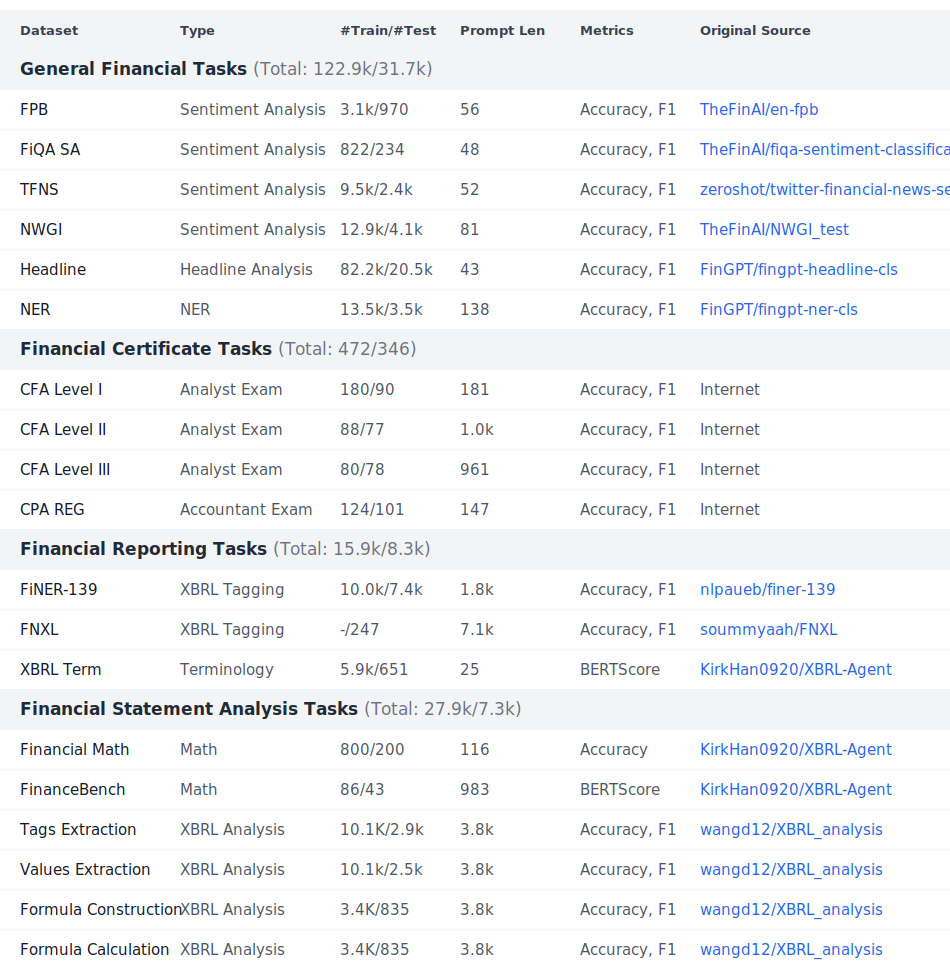
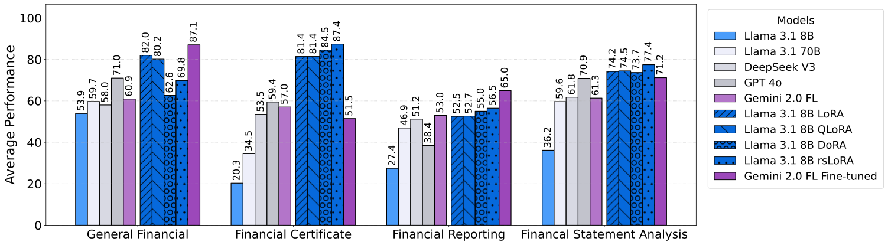

# FinLoRA: Benchmarking LoRA Methods for Fine-Tuning LLMs on Financial Datasets

<p>
  <a href="https://huggingface.co/datasets/wangd12/XBRL_analysis"></a>
  <a href="https://huggingface.co/spaces/wangd12/xbrl_llm_demo"></a>
  <a href="https://huggingface.co/wangd12/"></a>
  <a href="https://arxiv.org/abs/2505.19819"></a>
  <a href="https://finlora-docs.readthedocs.io/en/latest/"></a>

</p>

## Abstract

Low-rank adaptation (LoRA) methods offer an affordable solution to scale general-purpose
LLMs to hundreds of use scenarios. However, their efficacy in high-stakes domains like finance is rarely
explored, e.g., passing CFA exams and analyzing SEC filings.

This open-source FinLoRA project benchmarks LoRA methods on both general and highly professional financial tasks.
First, we curated 19 datasets covering diverse financial applications; in particular, four novel XBRL analysis datasets are based on 150 SEC
filings. Second, we evaluated five LoRA methods and five base LLMs. Finally, we provide extensive experimental results
in terms of accuracy, F1, and BERTScore and report computational cost in terms of time and GPU memory during fine-tuning
and inference stages. We find that LoRA methods achieved substantial performance gains of 36% on average over base
models. Our FinLoRA project provides an affordable and scalable approach to democratize financial intelligence to the
general public.

## Motivation

The proprietary [BloombergGPT](https://arxiv.org/abs/2303.17564) model announced in April 2023 highlighted the potential of financial Large Language Models (FinLLMs). However, such a "train-from-scratch" approach was resource-intensive, requiring one million GPU hours at an estimated cost of $3 million ($3 per GPU hour in 2023) and 512 A100 GPUs. This substantial investment underscores the need for a cost-effective solution.

We propose to leverage open-source models, such as Llama 3.1, and employ the LoRA (Low-Rank Adaptation)
fine-tuning method. It dramatically reduces the number of trainable parameters to as little as 0.01% of the full model's parameters. This enables fine-tuning on 4 A5000 GPUs and brings the cost of fine-tuning down to less than $100, making FinLLMs accessible to the general public.

## Financial Tasks

Our goal is to develop models capable of performing a range of financial tasks, from general applications to
professional-level functions. A critical area within professional finance is the eXtensible Business Reporting Language (XBRL), the global standard for digital business reporting. XBRL, being XML-based, is inherently complex, making it challenging for humans to curate and interpret directly.

We are particularly interested in two key XBRL applications:

**1. Financial Reporting:** Assisting small and medium-sized businesses (SMBs) in generating compliant financial reports in the XBRL format.

**2. Financial Statement Analysis:** Facilitating the extraction of data from XBRL financial reports and enabling insightful analysis.

## Datasets

We test Llama 3.1 8B Instruct with our LoRA adapters on 19 datasets across 4 different types of tasks, ranging from general financial tasks to professional level XBRL (eXtensible Business Reporting Language)-based financial statement analysis. The train-test splits for the four task categories are as follows: General Financial Tasks-122.9k/31.7k, Financial Certificate Tasks—472/346, Financial Reporting Tasks—15.9k/8.3k, and Financial Statement Analysis Tasks—Total: 27.9k/7.3k. For each task, we compute an accuracy and F1 score except for XBRL Term and Finance Bench, for which we compute a [BERTScore F1](https://arxiv.org/abs/1904.09675). The dataset statistics are shown below.

<p>
  <a style="cursor: text" href="#datasets"></a>
</p>

### Dataset Formats

Each dataset has a specific format:

**General Financial Tasks:**

- **Sentiment Analysis (FPB, FiQA SA, TFNS)**: In these datasets, a financial sentence must be classified with a sentiment from `{negative, neutral, positive}`.
- **NWGI Sentiment**: In NWGI, financial text is classified into 7-level sentiment from `{strong negative, moderately negative, mildly negative, neutral, mildly positive, moderately positive, strong positive}`. In our testing, we simplified this to the `{negative, neutral, positive}` set of sentiments.
- **Headline Analysis**: In the Headline dataset, financial headlines are classified with binary answers from `{Yes, No}` based on various questions like whether the headline talks about a share price going up.
- **Named Entity Recognition**: In NER, financial text with a highlighted entity is classified into entity types from `{person, location, organization}`.

**Financial Certificate Tasks:**

- **CFA Level I/II/III & CPA REG**: The CFA and CPA exams datasets include multiple choice questions from mock exams. the LLM must select an answer from `{A, B, C, D}` or `{A, B, C}` based on the question and context in the case of CFA Level II and CFA Level III. Our question set has a particular focus on ethics and regulations questions.

**Financial Reporting Tasks:**

- **XBRL Term**: In XBRL Term, the LLM must provide a brief explanation for XBRL terminology from the XBRL International website.
- **FiNER/FNXL Tagging**: In FiNER/FNX;, financial text contains numerical entities that must be tagged with appropriate US GAAP tags. Answers are comma-separated when multiple entities need tagging.

**Financial Statement Analysis Tasks:**

- **XBRL Tag Extraction**: In XBRL tag extraction, the LLM analyzes XBRL context and must respond with an XBRL tag for a specific element.
- **XBRL Value Extraction**: In XBRL value extraction, the LLM analyzes XBRL context to find specific numerical values.
- **XBRL Formula Construction**: In XBRL formula construction, the LLM creates financial formulas using US GAAP tags.
- **XBRL Formula Calculation**: In XBRL formula calculation, the LLM substitutes actual numerical values from the XBRL context into financial formulas.
- **Financial Math**: In Financial Math, the LLM applies financial formulas to solve numerical problems given a formula and specific values.
- **FinanceBench**: In FinanceBench, the LLM answers various questions based on XBRL financial reports.

[//]: #
[//]: #
[//]: # '| **Datasets**                                               | **Types**                | **#Train/#Test** | **Average'
[//]: # 'Prompt Length** | **Metrics**  | **Original Source & License'
[//]: # '**                                                                                                                      |'
[//]: #
[//]: # '|------------------------------------------------------------|--------------------------|------------------|---------------------------|--------------|----------------------------------------------------------------------------------------------------------------------------------------------------|'
[//]: #
[//]: # '| **General Financial Tasks** (Total: 122.9k/31.7k)          | | | | | |'
[//]: #
[//]: # '| FPB | Sentiment Analysis | 3.1k/970 | 56 | Accuracy,'
[//]: # 'F1 | [TheFinAI/en-fpb](https://huggingface.co/datasets/TheFinAI/en-fpb), CC BY-SA 3.0 |'
[//]: #
[//]: # '| FiQA SA | Sentiment Analysis | 822/234 | 48 | Accuracy,'
[//]: # 'F1 | [TheFinAI/fiqa-sentiment-classification](https://huggingface.co/datasets/TheFinAI/fiqa-sentiment-classification),'
[//]: # 'MIT |'
[//]: #
[//]: # '| TFNS | Sentiment Analysis | 9.5k/2.4k | 52 | Accuracy,'
[//]: # 'F1 | [zeroshot/twitter-financial-news-sentiment](https://huggingface.co/datasets/zeroshot/twitter-financial-news-sentiment),'
[//]: # 'MIT |'
[//]: #
[//]: # '| NWGI | Sentiment Analysis | 12.9k/4.1k | 81 | Accuracy,'
[//]: # 'F1 | [TheFinAI/NWGI_test](https://huggingface.co/datasets/TheFinAI/NWGI_test), MIT |'
[//]: #
[//]: # '| Headline | Headline Analysis | 82.2k/20.5k | 43 | Accuracy,'
[//]: # 'F1 | [FinGPT/fingpt-headline-cls](https://huggingface.co/datasets/FinGPT/fingpt-headline-cls), CC BY-SA 3.0 |'
[//]: #
[//]: # '| NER | Named Entity Recognition | 13.5k/3.5k | 138 | Accuracy,'
[//]: # 'F1 | [FinGPT/fingpt-ner-cls](https://huggingface.co/datasets/FinGPT/fingpt-ner-cls), CC BY-SA 3.0 |'
[//]: #
[//]: # '| **Financial Certificate Tasks** (Total: 472/346)           | | | | | |'
[//]: #
[//]: # '| CFA Level I | Analyst Exam | 180/90 | 181 | Accuracy, F1 | Internet (Public; Not Released Due to'
[//]: # 'Copyright)                                                                                                   |'
[//]: #
[//]: # '| CFA Level II | Analyst Exam | 88/77 | 1.0k | Accuracy, F1 | Internet (Public; Not Released Due to'
[//]: # 'Copyright)                                                                                                   |'
[//]: #
[//]: # '| CFA Level III | Analyst Exam | 80/78 | 961 | Accuracy, F1 | Internet (Public; Not Released Due to'
[//]: # 'Copyright)                                                                                                   |'
[//]: #
[//]: # '| CPA REG | Accountant Exam | 124/101 | 147 | Accuracy, F1 | Internet (Public; Not Released Due to'
[//]: # 'Copyright)                                                                                                   |'
[//]: #
[//]: # '| **Financial Reporting Tasks** (Total: 15.9k/8.3k)          | | | | | |'
[//]: #
[//]: # '| FiNER-139 | XBRL Tagging | 10.0k/7.4k | 1.8k | Accuracy,'
[//]: # 'F1 | [nlpaueb/finer-139](https://huggingface.co/datasets/nlpaueb/finer-139), CC BY-SA 4.0 |'
[//]: #
[//]: # '| FNXL | XBRL Tagging | -/247 | 7.1k | Accuracy, F1 | [soummyaah/FNXL](https://github.com/soummyaah/FNXL), Public |'
[//]: #
[//]: # '| XBRL Term | Terminology | 5.9k/651 | 25 |'
[//]: # 'BERTScore | [KirkHan0920/XBRL-Agent](https://github.com/KirkHan0920/XBRL-Agent/blob/main/Datasets/XBRL%20Terminology.xlsx),'
[//]: # 'MIT |'
[//]: #
[//]: # '| **Financial Statement Analysis Tasks** (Total: 27.9k/7.3k) | | | | | |'
[//]: #
[//]: # '| Financial Math | Math | 800/200 | 116 |'
[//]: # 'Accuracy | [KirkHan0920/XBRL-Agent](https://github.com/KirkHan0920/XBRL-Agent/blob/main/Datasets/formulas_with_explanations_with_questions_with_gt.xlsx),'
[//]: # 'MIT |'
[//]: #
[//]: # '| FinanceBench | Math | 86/43 | 983 |'
[//]: # 'BERTScore | [KirkHan0920/XBRL-Agent](https://github.com/KirkHan0920/XBRL-Agent/blob/main/Datasets/financebench.xlsx), CC'
[//]: # 'BY-NC 4.0 |'
[//]: #
[//]: # '| Tags Extraction | XBRL Analysis | 10.1K/2.9k | 3.8k | Accuracy,'
[//]: # 'F1 | [wangd12/XBRL_analysis](https://huggingface.co/datasets/wangd12/XBRL_analysis), MIT |'
[//]: #
[//]: # '| Values Extraction | XBRL Analysis | 10.1k/2.5k | 3.8k | Accuracy,'
[//]: # 'F1 | [wangd12/XBRL_analysis](https://huggingface.co/datasets/wangd12/XBRL_analysis), MIT |'
[//]: #
[//]: # '| Formula Construction | XBRL Analysis | 3.4K/835 | 3.8k | Accuracy,'
[//]: # 'F1 | [wangd12/XBRL_analysis](https://huggingface.co/datasets/wangd12/XBRL_analysis), MIT |'
[//]: #
[//]: # '| Formula Calculation | XBRL Analysis | 3.4K/835 | 3.8k | Accuracy,'
[//]: # 'F1 | [wangd12/XBRL_analysis](https://huggingface.co/datasets/wangd12/XBRL_analysis), MIT |'

## Benchmark Results



We use Llama 3.1 8B Instruct as the base model.

As illustrated in the performance comparison above, Llama 3.1 8B Intruct with our LoRA adpaters demonstrates substantial improvements across all financial task categories. The fine-tuned Llama 3.1 8B model using various LoRA methods achieves remarkable performance gains, with improvements ranging from +36.4% to +67.1% across different task types. Most notably, LoRA methods show exceptional effectiveness in **Financial Certificate** tasks (professional exams like CFA and CPA), where models achieve over 80% accuracy compared to the base model's 13-32% range. Similarly, our LoRA adpaters show significant improvements of +40% to +52% in **Financial Statement Analysis** tasks, particularly in our novel XBRL analysis datasets, highlighting LoRA's capability in handling complex, structured financial data.

The results reveal that, while larger base models like GPT-4o and DeepSeek V3 perform well on general financial tasks, our cost-effective LoRA-adapted Llama 3.1 8B models often match or exceed their performance while requiring only a fraction of the computational resources. This validates our approach of democratizing financial intelligence through parameter-efficient fine-tuning, making sophisticated financial AI accessible to organizations without massive computational budgets.

Our models achieve the following performance on financial tasks. The table below shows accuracy/F1 scores. -/value represents BERTScore F1.

<details><summary>Full Results</summary>

| **Datasets**                           | **Base Models**       |                        |             |             |               | **Fine-tuned Models**      |                             |                            |                              |                     |
| -------------------------------------- | --------------------- | ---------------------- | ----------- | ----------- | ------------- | -------------------------- | --------------------------- | -------------------------- | ---------------------------- | ------------------- |
|                                        | Llama 3.1 8B Instruct | Llama 3.1 70B Instruct | DeepSeek V3 | GPT-4o      | Gemini 2.0 FL | Llama 3.1 8B Instruct LoRA | Llama 3.1 8B Instruct QLoRA | Llama 3.1 8B Instruct DoRA | Llama 3.1 8B Instruct rsLoRA | Gemini 2.0 FL       |
| **General Financial Tasks**            |                       |                        |             |             |               |                            |                             |                            |                              |                     |
| FPB                                    | 68.73/0.677           | 74.50/0.736            | 78.76/0.764 | 81.13/0.818 | 81.02/0.894   | 85.64/0.922                | 84.16/0.909                 | 81.93/0.901                | 82.84/0.853                  | **87.62**/0.878     |
| FiQA SA                                | 46.55/0.557           | 47.27/0.565            | 60.43/0.686 | 72.34/0.773 | 68.09/0.810   | 81.28/**0.884**            | 78.30/0.874                 | 78.72/0.874                | 73.19/0.806                  | **88.09**/0.879     |
| TFNS                                   | 69.97/0.683           | 68.42/0.686            | 84.38/0.846 | 73.32/0.740 | 26.38/0.385   | 88.02/**0.932**            | 83.84/0.910                 | 59.09/0.702                | 59.51/0.655                  | **89.49**/0.896     |
| NWGI                                   | 43.86/0.583           | 50.14/0.596            | 7.44/0.097  | 66.61/0.656 | 48.16/0.614   | 54.16/**0.690**            | 49.96/0.645                 | 19.57/0.281                | 35.80/0.464                  | **62.59**/0.581     |
| NER                                    | 48.89/0.569           | 46.28/0.454            | 40.82/0.360 | 52.11/0.523 | 65.13/0.769   | **98.05**/**0.981**        | 96.63/0.966                 | 71.59/0.834                | 95.92/0.963                  | 97.29/0.973         |
| Headline                               | 45.34/0.558           | 71.68/0.729            | 76.06/0.779 | 80.53/0.814 | 76.60/0.847   | 84.66/0.852                | 88.03/0.886                 | 64.93/0.781                | 71.75/0.828                  | **97.32**/**0.973** |
| **Financial Certificate Tasks**        |                       |                        |             |             |               |                            |                             |                            |                              |                     |
| CFA Level 1                            | 13.33/0.133           | 42.22/0.418            | 54.44/0.556 | 63.33/0.631 | 55.56/0.556   | 86.67/0.867                | **87.78**/**0.878**         | **87.78**/**0.878**        | **87.78**/**0.878**          | 52.22/0.530         |
| CFA Level 2                            | 19.48/0.199           | 29.87/0.303            | 46.75/0.485 | 55.84/0.563 | 56.67/0.567   | 88.31/0.883                | 83.12/0.835                 | 90.91/0.909                | **92.21**/**0.922**          | 51.11/0.519         |
| CFA Level 3                            | 16.67/0.179           | 24.36/0.271            | 47.44/0.496 | 51.28/0.517 | 52.56/0.538   | 70.51/0.705                | 66.67/0.675                 | 69.23/0.697                | **79.49**/**0.795**          | 51.28/0.557         |
| CPA REG                                | 31.68/0.317           | 41.58/0.426            | 65.35/0.654 | 67.33/0.667 | 63.37/0.638   | 80.20/0.802                | 88.12/0.885                 | **90.10**/**0.901**        | **90.10**/**0.901**          | 51.28/0.557         |
| **Financial Reporting Tasks**          |                       |                        |             |             |               |                            |                             |                            |                              |                     |
| FiNER                                  | 21.28/0.232           | 61.82/0.606            | 68.92/0.699 | 72.29/0.725 | 63.91/0.638   | 74.10/0.759                | 74.32/0.760                 | 70.92/0.732                | 70.72/0.724                  | **80.32**/**0.802** |
| FNXL                                   | 3.64/0.045            | 20.14/0.210            | 27.33/0.288 | 42.41/0.398 | 37.75/0.356   | 23.57/0.250                | 23.05/0.253                 | 33.50/0.311                | 35.68/0.348                  | **47.98**/**0.438** |
| XBRL Term                              | -/0.574               | -/0.587                | -/0.573     | -/0.584     | -/0.572       | -/0.599                    | -/0.606                     | -/0.606                    | -/0.630                      | -/**0.666**         |
| **Financial Statement Analysis Tasks** |                       |                        |             |             |               |                            |                             |                            |                              |                     |
| Tag Extraction                         | 69.16/0.739           | 69.64/0.782            | 85.03/0.849 | 81.60/0.864 | 80.27/0.811   | **89.13**/0.886            | 86.89/0.872                 | 80.44/0.896                | 85.26/0.879                  | 85.03/**0.907**     |
| Value Extraction                       | 52.46/0.565           | 88.19/0.904            | 98.01/0.982 | 97.01/0.974 | 98.02/0.980   | 98.49/0.986                | 97.14/0.974                 | 98.57/0.988                | 99.13/**0.992**              | **99.20**/**0.992** |
| Formula Construction                   | 12.92/0.201           | 59.28/0.665            | 22.75/0.315 | 79.76/0.820 | 61.90/0.644   | 77.61/0.876                | 89.34/**0.898**             | 88.02/0.882                | **89.46**/0.893              | 67.85/0.786         |
| Formula Calculation                    | 27.27/0.317           | 77.49/0.783            | 85.99/0.868 | 83.59/0.857 | 53.57/0.536   | 98.68/0.990                | 92.81/0.947                 | **98.92**/**0.993**        | 98.80/0.988                  | 54.76/0.548         |
| FinanceBench                           | -/0.443               | -/0.528                | -/0.573     | -/0.564     | -/0.552       | -/0.511                    | -/0.542                     | -/0.477                    | -/**0.575**                  | -/0.544             |
| Financial Math                         | 11.00/0.136           | 10.50/0.134            | 21.50/0.255 | 27.00/0.296 | 19.00/0.204   | 30.00/0.332                | 26.50/0.307                 | 28.50/0.317                | 34.50/0.370                  | **66.00**/**0.785** |
| Overall Average                        | 37.05                 | 52.36                  | 57.16       | 63.39       | 58.97         | **74.74**                  | 74.29                       | 69.53                      | 73.82                        | 71.08               |

</details>

## LoRA Methods

We use four LoRA methods: LoRA, QLoRA, DoRA, and rsLoRA.

You can download LoRA adapaters from the `lora_adapters` directory or [Hugging Face](https://huggingface.co/wangd12). The adapters are fine-tuned on financial datasets using various configurations (e.g., 8-bit rank 8 and 4-bit rank 4).

## File Structure

```
FinLoRA/
├── data/
│   ├── *.py  # Dataset processing code
│   ├── test/  # Test datasets
│   └── train/  # Training datasets
├── docs/  # Documentation
├── lora/
│   ├── finetune.py  # Fine-tuning code using Axolotl
│   ├── flowertune-llm/  # Federated learning implementation
│   └── lora/  # Fine-tuning using HF PEFT
├── lora_adapters/
│   ├── 4bits_r4/
│   ├── 8bits_r8/
│   ├── 8bits_r8_dora/
│   ├── 8bits_r8_rslora/
│   ├── fp16_r8/
├── test/
│   ├── __init__.py
│   ├── fingpt_tests/
│   ├── inference.py
│   ├── README.md
│   ├── *.sh  # Test shell scripts
│   └── *.py
├── environment.yml
├── LICENSE
├── README.md
├── readthedocs.yml
├── requirements.txt
├── setup.sh
└── sphinx_requirements.txt
```

## Guide

### Environment Setup

This guide will help you set up the environment for FinLoRA.

#### GPU Requirements

FinLoRA works with CUDA-enabled GPUs. CUDA should be at least version 11.8.

GPU memory requirements depend on the size of the LLM, quantization, batch size, and prompt length. For Llama 3.1 8B Instruct, we reccomend the following:

- **NVIDIA GPU with at least 24GB VRAM** for 8-bit quantization
- **NVIDIA GPU with at least 16GB VRAM** for 4-bit quantization

#### Runpod Setup (optional)

If you don't have access to GPUs with sufficient VRAM, you can rent them affordably from cloud providers like [RunPod](https://www.runpod.io). To create a proper Runpod environment, you can follow these steps:

1. After you have created a Runpod account, go to the "Billing" tab and add $10 of credits. In our testing, when we rented 4 A5000 GPUs, we spent an average of $1.05/hr.
2. Now go click on the "Storage" tab. This tab allows you to create network volumes for persistent storage of uploaded files and models if you disconnect from the service.
3. Click on "New Network Volume" and select a Datacenter that shows that RTX A5000s are available.
4. Name your network volume and add make the size of the volume 50 GB. This should only cost $3.50 a month. Then click "Create Network Volume."
5. Under the storage tab, click "Deploy" on your network volume. Select the RTX A5000 GPU.
6. Name your pod, set "GPU Count" to 4, and select the "Runpod Pytorch 2.8.0" pod template. Note: If you only want to run inference instead of fine-tuning, you can select 1.
7. Make sure the instance pricing is set to on-demand. This should cost $0.26/hr per A5000 GPU.
8. Click "Deploy On-Demand."

#### Package Installation

You can set up the environment using either the provided setup script or conda environment file.

##### Using setup.sh

The easiest way to set up the environment is to use the provided setup script:

```bash
git clone https://github.com/Open-Finance-Lab/FinLoRA.git
cd FinLoRA
chmod +x setup.sh
./setup.sh
```

This script will install all the required dependencies, including:

- PyTorch with CUDA support
- Transformers library
- Axolotl for fine-tuning
- Other required libraries

##### Using conda

Alternatively, you can use the provided conda environment file:

```bash
conda env create -f environment.yml
conda activate finenv
```

#### Login to Hugging Face

When using Llama models, you need to login to Hugging Face due to the LLMs being gated. Run the following command:

```bash
huggingface-cli login
```

You will be prompted to enter your Hugging Face token. You can find your token at https://huggingface.co/settings/tokens.

Alternatively, you can set the HF_TOKEN environment variable:

```bash
export HF_TOKEN=your_token_here
```

### Fine-Tuning

1. To perform fine-tuning, first navigate to the lora directory and fetch deepspeed configs. The deepspeed configs allow the fine-tuning framework to parallelize fine-tuning across GPUs

```bash
cd lora
axolotl fetch deepspeed_configs
```

2. Add your fine-tuning dataset (e.g., `your_dataset_train.jsonl`) in the `../data/train/` folder.

3. Open `finetune_configs.json` and add the configursation for the LoRA adapter you want to create with hyperparameters defined. There are examples you can reference in the file. The following is an example:

```json
"your_config_name": {
  "base_model": "meta-llama/Llama-3.1-8B-Instruct",
  "dataset_path": "../data/train/your_dataset_train.jsonl",
  "lora_r": 8,
  "quant_bits": 8,
  "learning_rate": 0.0001,
  "num_epochs": 1,
  "batch_size": 4,
  "gradient_accumulation_steps": 2
}
```

4. Run fine-tuning with your configuration by executing the following command:

```bash
python finetune.py your_config_name
```

For example, to use the existing formula configuration:

```bash
python finetune.py formula_llama_3_1_8b_8bits_r8
```

5. After fine-tuning completes, the adapter will be saved in the `axolotl-output` subfolder within the 'lora' folder. Download the adapter files from this directory. You can remove checkpoints

If you don't have compute resources, you can rent 4 A5000s at a low cost from [RunPod](https://www.runpod.io).

### Using Your LoRA Adapter

Once you have trained a LoRA adapter, you can use it for inference by modifying the following code:

```python
from transformers import AutoTokenizer, AutoModelForCausalLM
from peft import PeftModel
import torch

# Load base model and tokenizer
base_model_name = "meta-llama/Llama-3.1-8B-Instruct"
tokenizer = AutoTokenizer.from_pretrained(base_model_name)
base_model = AutoModelForCausalLM.from_pretrained(
    base_model_name,
    torch_dtype=torch.float16,
    device_map="auto",
    trust_remote_code=True
)

# Load and apply the LoRA adapter
adapter_path = "./path/to/your/adapter"  # Path to your adapter
model = PeftModel.from_pretrained(base_model, adapter_path)

# Generate text
prompt = "What is the formula for the Black-Scholes model?"
inputs = tokenizer(prompt, return_tensors="pt").to(model.device)

with torch.no_grad():
    outputs = model.generate(
        **inputs,
        max_new_tokens=512,
        # This ensures that you get reproducible responses.
        temperature=0,
        pad_token_id=tokenizer.eos_token_id
    )

response = tokenizer.decode(outputs[0], skip_special_tokens=True)
print(response)
```

### Federated Learning

To run federated LoRA, navigate to the federated learning directory:

```bash
cd lora/flowertune-llm
```

Install dependencies:

```bash
pip install -e .
```

Run the federated learning simulation:

```bash
flwr run .
```

You can customize the configuration:

```bash
# Use OpenLLaMA-7B instead of 3B and 8-bits quantization
flwr run . --run-config "model.name='openlm-research/open_llama_7b_v2' model.quantization=8"

# Run for 50 rounds with 25% client participation
flwr run . --run-config "num-server-rounds=50 strategy.fraction-fit=0.25"
```

### Evaluation

Please note that the fp16 adapters we created are experimental and untested. They may not be suitable for use.

To test adapters, navigate to the test directory:

```bash
cd test
bash run_all_adapters.sh
```

Define the adapters and tasks you want to run in the script, then execute:

```bash
bash run_all_adapters.sh
```

To run a base model (e.g., OpenAI):

```bash
bash run_openai.sh
```

Enter your API key in the file, set the tasks to run, then execute:

```bash
bash run_openai.sh
```

[//]: #
[//]: # '## Scenarios'
[//]: #
[//]: # '### Cross-task Generalization (Mixture of LoRA Experts)'
[//]: #
[//]: # 'We started with single-task fine-tuning, i.e., fine-tuning a LoRA adapter for a task. We got good performance.'
[//]: #
[//]: # 'Mixture of LoRA Experts (LoRA-MoE): a LoRA module acts as an expert, a router network assigns weights, such as'
[//]: # 'in [X-LoRA](https://arxiv.org/pdf/2402.07148). X-LoRA is built on top of HuggingFace PEFT.'
[//]: #
[//]: # '### Improving Performance and Scalability for Inference Stage'
[//]: #
[//]: # 'SLoRA is designed for serving many LoRA adapters efficiently. It stores all adapters in the CPU memory and fetches the'
[//]: # 'adapters needed to GPU memory. We will deploy it on a cloud server.'
[//]: #
[//]: # 'Difficulty: Current SLoRA implementation does not work with HuggingFace, and does not support newer models like Llama 3.'
[//]: #
[//]: # '### Distributed Training with Enhanced Privacy'
[//]: #
[//]: # 'Multiple institutions might want to collaborate to fine-tune a FinLLM using their private datasets. Using zero-Knowledge'
[//]: # 'Proofs (ZKPs) in the fine-tuning stage allows enhanced data privacy.'

## Contributing

We welcome contributions to the FinLoRA project! Please feel free to submit issues, feature requests, and pull requests.

## License

This project is released under OpenMDW-1.0. Please check individual dataset licenses for specific usage terms.

## Citation

If you use this work, please cite:

```bibtex
@article{wang2025finlora,
  title={FinLoRA: Benchmarking LoRA Methods for Fine-Tuning LLMs on Financial Datasets},
  author={Wang, Dannong and Patel, Jaisal and Zha, Daochen and Yang, Steve Y and Liu, Xiao-Yang},
  journal={arXiv preprint arXiv:2505.19819},
  year={2025}
}
```
