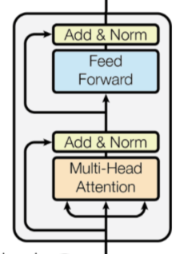
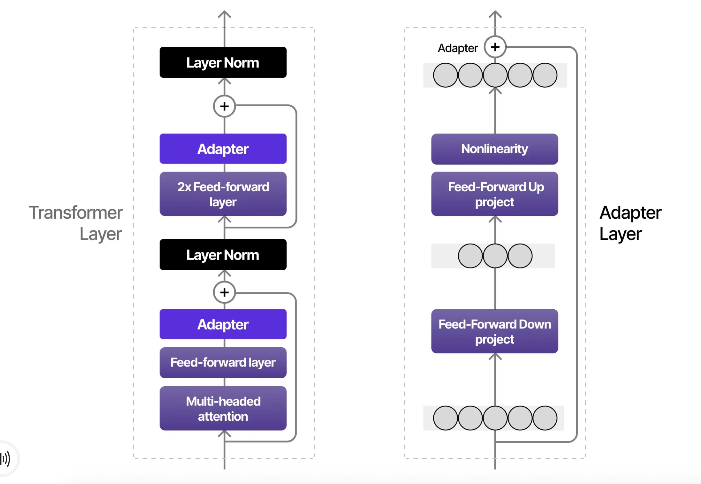
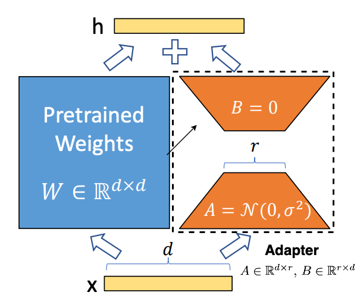

Low‑Rank Adaptation Methods for Large Language Models
=======================================================

.. contents::
   :local:
   :depth: 2

1. What is LoRA?
----------------
LoRA is a method to efficiently update the parameters  
of pre‑trained language models when fine‑tuning on new tasks.

2. Foundations of LoRA
----------------------

2.1 Ranks
~~~~~~~~~
Rank is the number of linearly independent rows or columns  
in a matrix. Linearly independent columns, for example, are  
columns whose values can't be computed by an addition of  
previous columns multiplied by an integer.

::

    W = [1  7  2  8  5
         2 10  4 12 10
         3 15 12 18 27
         4 12 16 16 36]   ---> Dimensions: 4 x 5 (rows x columns)

In the above matrix, there are 2 linearly independent columns,  
so the rank is 2.

• Column 1 has no previous rows, so it is linearly independent.  
• Column 2 can't be computed as a multiple of column 1, so  
  it is linearly independent.  
• Columns 3‑5 are linearly dependent.  
    • C₃ = 2 C₁ + 0 C₂  
    • C₄ = 1 C₁ + 1 C₂  
    • C₅ = 1 C₁ + 2 C₂  

If we convert the formulas to vectors, we can represent them as:

.. code-block:: text
   :class: matrix

       [1]      [0]
       [0]      [1]
       [2]      [0]
       [1] C₁ + [2] C₂

.. code-block:: text
   :class: matrix

       [1 0]
       [0 1]
       [2 0]        or   [1 0 2 1 1
       [1 2]              0 1 0 1 2]

If we take the matrix multiplication of the two linearly independent  
columns (C₁ and C₂) and either representation above, we recover the  
original matrix **W**.

Low‑rank decomposition example
::

    W = [1  7  2  8  5
         2 10  4 12 10
         3 15 12 18 27
         4 12 16 16 36]

      = [1  7
         2 10
         3 15   [1 0 2 1 1
         4 12]   0 1 0 1 2]

    Dimensions(W) = d x k = 4 x 5
    Dimensions(A) = d x r = 4 x 2   r = rank (rank = 2)
    Dimensions(B) = r x k = 2 x 5
    Dimensions(A*B) = (d x r) * (r x k) = d x k = Dimensions(W)

    Parameters(W) = 4 x 5 = 20
    Parameters(A) = 4 x 2 =  8
    Parameters(B) = 2 x 5 = 10
    Parameters(A+B) = 8 + 10 = 18

∴ Less parameters are stored if we use the representation  
  of the **A** and **B** matrices.

IF r << min{d,k}, this would be used due to  
having to store less parameters. This is called *low‑rank*.

In the example, 2 << min{4,5} = 2 << 4.

2.2 1 Fine‑tuning Without Adapters
~~~~~~~~~~~~~~~~~~~~~~~~~~~~~~~~~~~
Say we have a pre‑trained model **M** with **500 million**  
parameters. M has the below architecture.

Say we pre‑tuned M with two tasks. Task 1 is **Masked Language Modeling (MLM)**, where we mask some words in a sentence, and the task is to predict the sentence with the masked tokens filled in. Task 2 is **Next Sentence Predicting (NSP)**, where the task is to predict if, given 2 sentences, whether sentence A comes before sentence B.

Say we want to fine‑tune pre‑trained model M on a new task **Named Entity Recognition (NER)**, where the task is to annotate one entity (location/person/organization) per sentence in a financial task.

When we fine‑tune the model, all parameters are updated during back‑propagation. Back‑propagation is where we compare the error (difference between the predicted output and the actual output) and send the error backwards through the model, computing the gradient of error with respect to each weight. A pictorial representation is below.

.. figure:: ./images/backpropogation.png
   :width: 70%
   :align: center
   :alt: Backpropogation Pictorial Representation

If we want to fine‑tune model M on another task **Financial Phrase Bank (FPB)**, where the task is to annotate sentences from financial news and reports with sentiment, we still need to update all 500 million parameters. This is costly and can lead to over‑fitting and the model forgetting pre‑training tasks.

2.2.2 Fine‑tuning With Adapters (Parameter Efficient Finetuning — PEFT)
~~~~~~~~~~~~~~~~~~~~~~~~~~~~~~~~~~~~~~~~~~~~~~~~~~~~~~~~~~~~~~~~~~~~~~~
Say instead, when we want to fine‑tune the pre‑trained model M we use **Parameter Efficient Finetuning (PEFT)**, where we add two adapter layers per transformer layer. The architecture of M now looks like the following.

Now, when we fine‑tune M on NER, only the parameters of the adapter layer are updated, but the other weights/parameters are frozen, so during back‑propagation, the gradients of error pass through them, but those weights/parameters aren't updated. While we do have to replace the adapters and store the updated params separately for FPB, the number of parameters is now much smaller.

3 Low‑Rank Adaptation (LoRA)
----------------------------
Say instead, we fine‑tune with **Low‑Rank Adaptation**. Model M is adapted as the following.

Low‑rank : r << min(d,k)  
           = r << min(d,d)  
           = r << min(d)  
           = r << d

For every Multi‑Head Attention layer in Model M, there are unique weight matrices
for the …

* **Queries** (:math:`W_q`)
* **Keys**   (:math:`W_k`)
* **Values** (:math:`W_v`)

as shown below.

.. figure:: ./images/Multi_Head_Attention.png
   :width: 70%
   :align: center
   :alt: Multi-Head Attention Weight Matrices

In LoRA, we transform these weight matrices into **A B** products exactly as in Section 2.1.1

.. math::

   W_Q^{(n)} = A_Q^{(n)} \, B_Q^{(n)} \\
   W_K^{(n)} = A_K^{(n)} \, B_K^{(n)} \\
   W_V^{(n)} = A_V^{(n)} \, B_V^{(n)}

During fine‑tuning, all parameters inside **A** and **B** for the queries,
keys and values are updated; all other weights remain frozen.

.. math::

   W_{Q,\text{new}}^{(n)} = W_{Q,\text{old}}^{(n)} + A_Q^{(n)} B_Q^{(n)} \\
   W_{K,\text{new}}^{(n)} = W_{K,\text{old}}^{(n)} + A_K^{(n)} B_K^{(n)} \\
   W_{V,\text{new}}^{(n)} = W_{V,\text{old}}^{(n)} + A_V^{(n)} B_V^{(n)}

Because the modification is in‑place, no extra layers or parameters are
added and inference time is unchanged.

References
----------
.. code-block:: bash

    @article{hu2022lora,
      title={Lora: Low-rank adaptation of large language models.},
      author={Hu, Edward J and Shen, Yelong and Wallis, Phillip and Allen-Zhu, Zeyuan and Li, Yuanzhi and Wang, Shean and Wang, Lu and Chen, Weizhu and others},
      journal={ICLR},
      volume={1},
      number={2},
      pages={3},
      year={2022}
    }

    @article{dettmers2023qlora,
      title={Qlora: Efficient finetuning of quantized llms},
      author={Dettmers, Tim and Pagnoni, Artidoro and Holtzman, Ari and Zettlemoyer, Luke},
      journal={Advances in neural information processing systems},
      volume={36},
      pages={10088--10115},
      year={2023}
    }

    @article{jiang2024mixtral,
      title={Mixtral of experts},
      author={Jiang, Albert Q and Sablayrolles, Alexandre and Roux, Antoine and Mensch, Arthur and Savary, Blanche and Bamford, Chris and Chaplot, Devendra Singh and Casas, Diego de las and Hanna, Emma Bou and Bressand, Florian and others},
      journal={arXiv preprint arXiv:2401.04088},
      year={2024}
    }

    @article{buehler2024x,
      title={X-LoRA: Mixture of low-rank adapter experts, a flexible framework for large language models with applications in protein mechanics and molecular design},
      author={Buehler, Eric L and Buehler, Markus J},
      journal={APL Machine Learning},
      volume={2},
      number={2},
      year={2024},
      publisher={AIP Publishing}
    }

    @inproceedings{liu2024dora,
      title={Dora: Weight-decomposed low-rank adaptation},
      author={Liu, Shih-Yang and Wang, Chien-Yi and Yin, Hongxu and Molchanov, Pavlo and Wang, Yu-Chiang Frank and Cheng, Kwang-Ting and Chen, Min-Hung},
      booktitle={Forty-first International Conference on Machine Learning},
      year={2024}
    }

    @misc{codeemporium2024lora,
      author       = {{CodeEmporium}},
      title        = {{LoRA Explained!}},
      howpublished = {\url{https://www.youtube.com/watch?v=Bq9zqTJDsjg}},
      year         = {2024}
    }

    @misc{sharma2023peft,
      author       = {Sharma, Rajeev},
      title        = {Parameter‐Efficient Fine‐Tuning (PEFT) of LLMs: A Practical Guide},
      howpublished = {\url{https://markovate.com/blog/parameter-efficient-fine-tuning-peft-of-llms-a-practical-guide/}},
      year         = {2023}
    }

    @misc{doshi2021transformers,
      author       = {Doshi, Ketan},
      title        = {Transformers Explained Visually (Part 3): Multi‑head Attention, deep dive},
      howpublished = {\url{https://medium.com/data-science/transformers-explained-visually-part-3-multi-head-attention-deep-dive-1c1ff1024853}},
      year         = {2021}
    }
