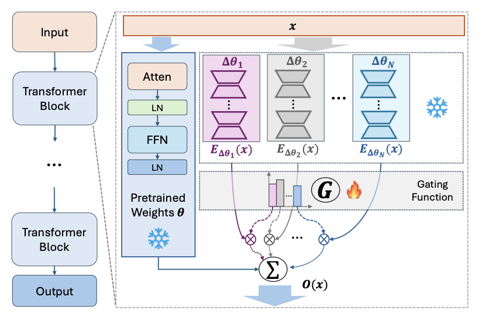
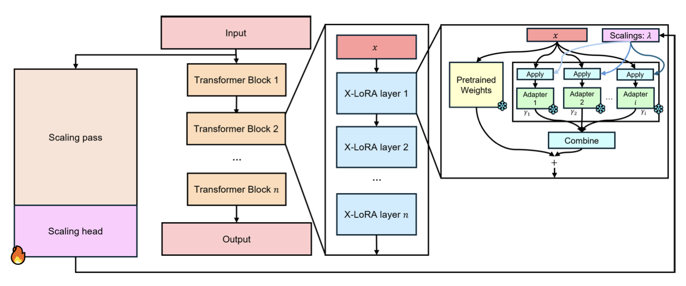

Low-Rank Adaptation Methods for Large Language Models
=======================================================

.. contents::
   :local:
   :depth: 4

1. What is LoRA?
----------------
LoRA is a method to efficiently update the parameters  
of pre-trained language models when fine-tuning on new tasks.

2. Foundations of LoRA
----------------------

2.1 Ranks
~~~~~~~~~
Rank is the number of linearly independent rows or columns  
in a matrix. Linearly independent columns, for example, are  
columns whose values can't be computed by an addition of  
previous columns multiplied by an integer.

.. math::

   W \;=\;
   \begin{bmatrix}
     1 &  7 &  2 &  8 &  5\\
     2 & 10 &  4 & 12 & 10\\
     3 & 15 & 12 & 18 & 27\\
     4 & 12 & 16 & 16 & 36
   \end{bmatrix}
   \quad\text{Dimensions: }4 \times 5\text{ (rows x columns)}

In this matrix there are **two** linearly independent columns, so
:math:`\operatorname{rank}(W)=2`.

* Column 1 is independent (nothing before it).  
* Column 2 cannot be written as a multiple of Column 1, so it is also independent.  
* Columns 3-5 are dependent:

.. math::

   C_3 = 2C_1, \quad
   C_4 = C_1 + C_2, \quad
   C_5 = C_1 + 2C_2.

If we convert the formulas to vectors, we can represent them as:

.. math::

   \begin{bmatrix}1\\0\\2\\1\end{bmatrix} C_1
   \;+\;
   \begin{bmatrix}0\\1\\0\\2\end{bmatrix} C_2

or equivalently,

.. math::

   \begin{bmatrix}
     1 & 0\\
     0 & 1\\
     2 & 0\\
     1 & 2
   \end{bmatrix}
   \quad\text{or}\quad
   \begin{bmatrix}
     1 & 0 & 2 & 1 & 1\\
     0 & 1 & 0 & 1 & 2
   \end{bmatrix}

If we take the matrix multiplication of the two linearly independent  
columns (C₁ and C₂) and either representation above, we recover the  
original matrix **W**.

Low-rank decomposition example

.. math::

   W \;=\;
   \begin{bmatrix}
     1 &  7 &  2 &  8 &  5\\
     2 & 10 &  4 & 12 & 10\\
     3 & 15 & 12 & 18 & 27\\
     4 & 12 & 16 & 16 & 36
   \end{bmatrix}

.. math::

   =
   \underbrace{\begin{bmatrix}
     1 &  7\\
     2 & 10\\
     3 & 15\\
     4 & 12
   \end{bmatrix}}_{A}
   \;
   \underbrace{\begin{bmatrix}
     1 & 0 & 2 & 1 & 1\\
     0 & 1 & 0 & 1 & 2
   \end{bmatrix}}_{B}

In the example:

.. math::

   \begin{aligned}
   \text{Dimensions}(W) &= d\times k &&= 4\times5 \\
   \text{Dimensions}(A) &= d\times r &&= 4\times2,\; r=\operatorname{rank}(W)=2 \\
   \text{Dimensions}(B) &= r\times k &&= 2\times5 \\
   \text{Dimensions}(A\!\cdot\!B) &= (d\times r)\,\cdot\,(r\times k) &&= d\times k &&= \text{Dimensions}(W)
   \end{aligned}

.. math::

   \text{Parameters}(W) &= 4 \times 5 = 20 \\
   \text{Parameters}(A) &= 4 \times 2 =  8 \\
   \text{Parameters}(B) &= 2 \times 5 = 10 \\
   \text{Parameters}(A+B) &= 8 + 10 = 18

∴ Less parameters are stored if we use the representation of the **A** and **B** matrices.

If r << min(d,k), this would be used due to  
having to store less parameters. This is called *low-rank*.

In the example, 2 << min(4,5) = 2 << 4.

2.2 Fine-tuning Strategies
~~~~~~~~~~~~~~~~~~~~~~~~~~

2.2.1 Fine-tuning Without Adapters
^^^^^^^^^^^^^^^^^^^^^^^^^^^^^^^^^^^
Say we have a pre-trained model **M** with **500 million** parameters. M has the below architecture.

.. figure:: ./images/Model_M_Architecture.png
   :width: 70%
   :align: center
   :alt: Model M Architecture

Assume we pre-tuned M with two tasks. Task 1 is **Masked Language Modeling (MLM)**, where we mask some words in a sentence, and the task is to predict the sentence with the masked tokens filled in. Task 2 is **Next Sentence Predicting (NSP)**, where the task is to predict if, given 2 sentences, whether sentence A comes before sentence B.

If we want to fine-tune pre-trained model M on a new task **Named Entity Recognition (NER)**, where the task is to annotate one entity (location/person/organization) per sentence in a financial task.

When we fine-tune the model, all parameters are updated during back-propagation. Back-propagation is where we compare the error (difference between the predicted output and the actual output) and send the error backwards through the model, computing the gradient of error with respect to each weight. A pictorial representation is below.

.. figure:: ./images/backpropogation.png
   :width: 70%
   :align: center
   :alt: Backpropogation Pictorial Representation

If we want to fine-tune model M on another task **Financial Phrase Bank (FPB)**, where the task is to annotate sentences from financial news and reports with sentiment, we still need to update all 500 million parameters. This is costly and can lead to over-fitting and the model forgetting pre-training tasks.

2.2.2 Fine-tuning With Adapters (Parameter Efficient Fine-Tuning—PEFT)
^^^^^^^^^^^^^^^^^^^^^^^^^^^^^^^^^^^^^^^^^^^^^^^^^^^^^^^^^^^^^^^^^^^^^^^
Say instead, when we want to fine-tune the pre-trained model M we use **Parameter Efficient Fine-Tuning (PEFT)**, where we add two adapter layers per transformer layer. The architecture of M now looks like the following.

.. figure:: ./images/Model_M_Architecture_Adapters.png
   :width: 70%
   :align: center
   :alt: Model M Architecture with Adapters

Now, when we fine-tune M on NER, only the parameters of the adapter layer are updated, but the other weights/parameters are frozen, so during back-propagation, the gradients of error pass through them, but those weights/parameters aren't updated. While we do have to replace the adapters and store the updated params separately for FPB, the number of parameters is now much smaller.

3 Low-Rank Adaptation (LoRA)
----------------------------
Say instead, we fine-tune with **Low-Rank Adaptation**. Model M is adapted as the following.

.. figure:: ./images/LoRA.png
   :width: 70%
   :align: center
   :alt: LoRA Mechanism

Low-rank: r << min(d,k) = r << min(d,d) = r << min(d) = r << d

For every Multi-head Attention layer in Model M, there are unique weight matrices
for the

* **Queries** (:math:`W_q`)
* **Keys** (:math:`W_k`)
* **Values** (:math:`W_v`)

as shown below.

.. figure:: ./images/Multi_Head_Attention.png
   :width: 70%
   :align: center
   :alt: Multi-head Attention Weight Matrices

In LoRA, we transform these weight matrices into **AB** products exactly as in Section 2.1.

.. math::

   W_Q^{(n)} = A_Q^{(n)} \, B_Q^{(n)} \\
   W_K^{(n)} = A_K^{(n)} \, B_K^{(n)} \\
   W_V^{(n)} = A_V^{(n)} \, B_V^{(n)}

During fine-tuning, all parameters inside **A** and **B** for the queries,
keys, and values are updated. All other weights remain frozen.

.. math::

   W_{Q\text{new}}^{(n)} = W_{Q\text{old}}^{(n)} + A_Q^{(n)} B_Q^{(n)} \\
   W_{K\text{new}}^{(n)} = W_{K\text{old}}^{(n)} + A_K^{(n)} B_K^{(n)} \\
   W_{V\text{new}}^{(n)} = W_{V\text{old}}^{(n)} + A_V^{(n)} B_V^{(n)}

Because the modification is in-place, no extra layers or parameters are
added, and inference time is unchanged.

4 Quantized Low-Rank Adaptation (QLoRA)
---------------------------------------
When fine-tuning, LoRA requires a large amount of GPU memory. To fix this, we can use Quantized Low-Rank Adaptation (QLoRA).
QLoRA drastically reduces the memory usage and allows for fine-tuning on a single GPU.

In QLoRA, we can quantize the weights of the adapter layers to reduce the number of parameters and the memory usage.
Quantization is a technique that reduces the precision of the weights to reduce the number of bits used to store them.
It consists of two parts: Rounding to the nearest integer and truncating to remove the decimal portion of a floating point number.
QLoRA specifically uses 4-bit NormalFloat (NF4), an optimal data type for normally distributed weights, quantization. Pre-trained weights are usually normally distributed and centered around 0, which is why NF4 is ideal for quantization.

Say we want to quantize from Float16 to Int4. Int4 has 4 bits, so we can represent :math:`2^{4}` = 16 different values, so we have 16 bins to represent all values. Inputs are usually normalized from -1 to 1.
Very close together values, however, will be mapped to the same bin. This means that the precision is lost if we want to convert back to Float16. However, we can use blockwise quantization, where we divide the input range into blocks and quantize each block separately. QLoRA uses a 64 blocksize for better precision.

Since regular quantization relies on the bins being equally probable, QLoRA uses NormalFloat where the bins are weighted by the normal distribution (remember, pre-trained weights are usually normally distributed and centered around 0). The spacing between bins is therefore closer together near 0 and further apart further away from 0.

Each block in QLoRA has a quantization constant. QLoRA employs Double Quantization, where it quantizes the quantization constants themselves to further save space.

The last part of QLoRA is Paged Optimizers, where QLoRA reduces GPU memory spikes by switching to CPU memory when the input is long and back to GPU memory after the input is read.

5 LoRA Methods with Federated Learning
---------------------------------------
In the financial domain, banks may have multiple departments who want to work together on a model to predict credit risk and whether a client will default on a loan. Each department may have a different dataset but they cannot share their data due to compliance reasons and privacy concerns.
Federated learning solves this issue by fine-tuning a model on local data and aggregating updates during backpropogation to a centralized model via a server.

Differentially Private Low-Rank Adaptation (DP-LoRA) is a method to use federated learning with LoRA. 

DP-LoRA first uses a server to send the current global LoRA weights (the A and B matrices from earlier) to all clients.

Every client does the following:
1) Get a minibatch of its private data
2) Compute the gradient for only its local A and B weights clipped with an ℓ₂ norm (square root of the sum of the squares of elements in the vector)
3) Adds Gaussian noise to the gradients
4) Updates the A and B matrices
5) Sends the updated A and B matrices to the server.

By adding noise, DP-LoRA prevents the centralized model from inferring the private data later on. This would allow the banks in the credit risk example to work on a model together.

As in normal federated learning, the server than aggregates the weights from all clients in a weighted average and sends the updated weights to all clients.

The process is shown below.

.. figure:: ./images/DP-LoRA.png
   :width: 70%
   :align: center
   :alt: DP-LoRA Algorithm

DP-LoRA can take advantage of the following:
1. File sharing using IPFS: IPFS is a protocols for decentralized organization and transferring
of files. Files shared on IPFS are verifiable as it uses cryptographic hashes to verify the
authenticity of files. The decentralized and distributed nature of IPFS also means that it is
good method for managing and transferring LoRA weights during federated training.
2. Proof of training: Zero-knowledge proof of training
3. Auditing of inference
4. Logs onto a chain (IPFS for major, small on chain)

6 LoRA Methods with Mixture of Experts (MoE)
---------------------------------------------

6.1 Mixture of Experts (MoE)
~~~~~~~~~~~~~~~~~~~~~~~~~~~~~
Since LLMs can be hundreds of billions of parameters, running them at inference time is expensive. In Mixture of Experts (MoE), we split the model into multiple experts. Each expert focuses on a different aspect of the input, and only relevant experts are used to answer the input.
Each expert is essentially a group of parameters.

In MoE, there are multiple experts between the input and output. There is a router network that picks what experts to use. The router network picks the experts based on scoring every expert for each token vector, using softmax to compute probabilities, and picking the k best (top-k) experts. The selection process is shown below.

.. figure:: ./images/MoE.png
   :width: 70%
   :align: center
   :alt: MoE Selection Process

The router network assigns weights to each expert and combines the outputs to create a final output.

In Mixtral 8x7B, there are 8 experts and a router network per layer. The router network picks the 2 most relevant experts to use for the input, and performs the previously mentioned process to get the final output.
Only experts and their parameters are activated in sparse layers (feed-forward networks within transformer blocks), lowering computational costs.
Mixtral 8x7B also uses load balancing where it prevents certain experts from being disproportionately used (leads to better performance). It does this by adding noise during the router netwrok selection process to make it more even. It also uses an additional loss to penalize skewed expert usage.

6.2 Fine-tuning Mixture of Experts (MoE) with QLoRA
~~~~~~~~~~~~~~~~~~~~~~~~~~~~~~~~~~~~~~~~~~~~~~~~~~
Fine-tuning on a MoE model with LoRA is done just like you would fine-tune a normal model. The router network is usually not updated. Due to the large total parameter count, we can use QLoRA to reduce the memory usage.

6.3 Mixture of Low-Rank Adapter Experts (MoLE/X-LoRA)
~~~~~~~~~~~~~~~~~~~~~~~~~~~~~~~~~~~~~~~~~~~~~~~~~~~~~
Two popular approaches to using LoRA models with MoE are MoLE and X-LoRA. 

**MoLE**: MoLE uses a learnable gating function that acts similar to MoE by treating multiple task-specific LoRAs at each layer as experts and using their concatenated adapter outputs to get the weights for the aggregated output. The same weights are used for all tokens within each layer.
MoLE is illustrated below.

When fine-tuning, both the backbone and all LoRA matrices are frozen. Only the layer-wise gates are fine-tuned on a domain-specific dataset.

MoLE has two inference modes: 
1. Using the learned gate weights as they are.
2. Masking (zeroing out) undesired LoRAs and renormalizing the weight distribution.

MoLE only uses one forward pass.

**X-LoRA**: X-LoRA adds a scaling head on top of the backbone. The scaling head takes the hidden state (function of inputs at a point) of each token at each layer and produces a vector consisting of scaling factors for each LoRA adapter.
As in MoLE, X-LoRA's experts are LoRAs at each layer.

X-LoRA uses two passes:
1. In the first pass, it runs the input on the frozen model and the scaling head to compute the LoRA adapter-specific scaling vectors for each token at each layer.
2. In the second pass, it runs the same input and gets output from summing the top-k (selected by the largest k scaling factors) LoRA adpaters' outputs multiplied by the scaling factors.

X-LoRA uses a load balancing technique like Mixtral to prevent any LoRA from being disproportionately used.

X-LoRA's architecture is shown below.

In our paper, we focus on the X-LoRA approach.

7 Weight-Decomposed Low-Rank Adaptation (DoRA)
-----------------------------------------------
LoRA makes simple changes to the model weights, so it sometimes doesn't capture the full complexity of the data and its relationships.
DoRA solves this issue of capturing data complexity. DoRA decomposes the weight matrices into a magnitude (the length of the columns in a weight matrix; computing by taking each column's ℓ₂ norm) vector and a direction (the direction of the columns in a weight matrix; computed by dividing each column by its ℓ₂ norm) matrix.
The magnitude vector m is of size 1 x k, where k is the number of columns. The direction matrix D is of size d x k, where d is the number of columns in a weight matrix.

The decomposition can be written compactly as

.. math::

   W
   \;=\;
   \mathbf m\,\frac{V}{\lVert V\rVert_{c}}
   \;=\;
   \lVert W\rVert_{c}\,
   \frac{W}{\lVert W\rVert_{c}},

where :math:`\lVert\cdot\rVert_{c}` denotes the column-wise ℓ₂ norm
(i.e.\ the norm is taken independently for each column).

Here is an example of the decomposition:

.. math::

   W \;=\;
   \begin{bmatrix}
    1 &  7 &  2 &  8 &  5\\
    2 & 10 &  4 & 12 & 10\\
    3 & 15 & 12 & 18 & 27\\
    4 & 12 & 16 & 16 & 36
   \end{bmatrix},
   \qquad W \in \mathbb{R}^{4\times 5}.

For column :math:`j`

.. math::

   \lVert \mathbf w_{j}\rVert_{2}
   \;=\;
   \sqrt{\sum_{i=1}^{4} W_{ij}^{\,2}}.

These norms form a :math:`1\times 5` magnitude vector:

.. math::

   \mathbf m
   \;=\;
   \bigl[\,5.4772,\;22.7596,\;20.4939,\;28.0713,\;46.3681\bigr]

The direction matrix is obtained by normalising each column of
:math:`W`:

.. math::

   V_{ij}
   \;=\;
   \frac{W_{ij}}{\lVert \mathbf w_{j}\rVert_{2}},
   \qquad \forall\,i,\,j.

Thus,

.. math::

   V
   \;=\;
   \begin{bmatrix}
    0.182574 & 0.307562 & 0.097590 & 0.284988 & 0.107833\\
    0.365148 & 0.439375 & 0.195180 & 0.427482 & 0.215666\\
    0.547723 & 0.659062 & 0.585540 & 0.641223 & 0.582297\\
    0.730297 & 0.527250 & 0.780720 & 0.569976 & 0.776396
   \end{bmatrix}

Every column of :math:`V` now has unit length:

.. math::

   \lVert \mathbf v_{j}\rVert_{2} \;=\; 1,
   \qquad \text{for all } j.

These are fine-tuned seperately. General fine-tuning/direct fine-tuning is applied to the magnitude matrix, while the direction matrix is fine-tuned using LoRA.

After the updates the recomposed weight matrix is

.. math::

   W'
   \;=\;
   \mathbf m\,
   \frac{V+\Delta V}{\lVert V+\Delta V\rVert_{c}}
   \;=\;
   \mathbf m\,
   \frac{W_0 + BA}{\lVert W_0 + BA\rVert_{c}}

DoRA is illustrated below.

.. figure:: ./images/DoRA.png
   :width: 70%
   :align: center
   :alt: DoRA Illustration

DoRA has the same inference cost as LoRA because the updated magnitude vector and direction matrix are merged back into the weight matrices of the query, keys, and values.
However, DoRA can capture complex relationships more due to being able to fine-tune the magnitude and direction. It only takes just a few extra parameters than LoRA.

References
----------
.. code-block:: bash

    @article{hu2022lora,
      title={Lora: Low-rank adaptation of large language models.},
      author={Hu, Edward J and Shen, Yelong and Wallis, Phillip and Allen-Zhu, Zeyuan and Li, Yuanzhi and Wang, Shean and Wang, Lu and Chen, Weizhu and others},
      journal={ICLR},
      volume={1},
      number={2},
      pages={3},
      year={2022}
    }

    @article{dettmers2023qlora,
      title={Qlora: Efficient finetuning of quantized llms},
      author={Dettmers, Tim and Pagnoni, Artidoro and Holtzman, Ari and Zettlemoyer, Luke},
      journal={Advances in neural information processing systems},
      volume={36},
      pages={10088--10115},
      year={2023}
    }

    @article{liu2025differentially,
      title={Differentially private low-rank adaptation of large language model using federated learning},
      author={Liu, Xiao-Yang and Zhu, Rongyi and Zha, Daochen and Gao, Jiechao and Zhong, Shan and White, Matt and Qiu, Meikang},
      journal={ACM Transactions on Management Information Systems},
      volume={16},
      number={2},
      pages={1--24},
      year={2025},
      publisher={ACM New York, NY}
    }

    @article{jiang2024mixtral,
      title={Mixtral of experts},
      author={Jiang, Albert Q and Sablayrolles, Alexandre and Roux, Antoine and Mensch, Arthur and Savary, Blanche and Bamford, Chris and Chaplot, Devendra Singh and Casas, Diego de las and Hanna, Emma Bou and Bressand, Florian and others},
      journal={arXiv preprint arXiv:2401.04088},
      year={2024}
    }

    @article{wu2024mixture,
      title={Mixture of lora experts},
      author={Wu, Xun and Huang, Shaohan and Wei, Furu},
      journal={arXiv preprint arXiv:2404.13628},
      year={2024}
    }

    @article{buehler2024x,
      title={X-LoRA: Mixture of low-rank adapter experts, a flexible framework for large language models with applications in protein mechanics and molecular design},
      author={Buehler, Eric L and Buehler, Markus J},
      journal={APL Machine Learning},
      volume={2},
      number={2},
      year={2024},
      publisher={AIP Publishing}
    }

    @inproceedings{liu2024dora,
      title={Dora: Weight-decomposed low-rank adaptation},
      author={Liu, Shih-Yang and Wang, Chien-Yi and Yin, Hongxu and Molchanov, Pavlo and Wang, Yu-Chiang Frank and Cheng, Kwang-Ting and Chen, Min-Hung},
      booktitle={Forty-first International Conference on Machine Learning},
      year={2024}
    }

    @misc{codeemporium2024lora,
      author       = {{CodeEmporium}},
      title        = {{LoRA Explained!}},
      howpublished = {\url{https://www.youtube.com/watch?v=Bq9zqTJDsjg}},
      year         = {2024}
    }

    @misc{aibites2023qlora,
      author       = {{AI Bites}},
      title        = {{QLoRA paper explained (Efficient Finetuning of Quantized LLMs)}},
      howpublished = {\url{https://www.youtube.com/watch?v=6l8GZDPbFn8}},
      year         = {2023}
    }

    @misc{sharma2023peft,
      author       = {Sharma, Rajeev},
      title        = {Parameter-Efficient Fine-Tuning (PEFT) of LLMs: A Practical Guide},
      howpublished = {\url{https://markovate.com/blog/parameter-efficient-fine-tuning-peft-of-llms-a-practical-guide/}},
      year         = {2023}
    }

    @misc{doshi2021transformers,
      author       = {Doshi, Ketan},
      title        = {Transformers Explained Visually (Part 3): Multi-head Attention, deep dive},
      howpublished = {\url{https://medium.com/data-science/transformers-explained-visually-part-3-multi-head-attention-deep-dive-1c1ff1024853}},
      year         = {2021}
    }
